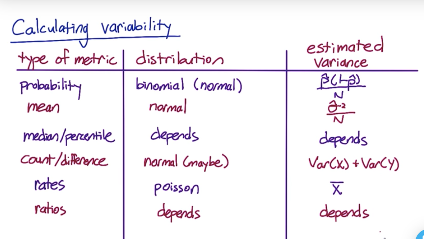

## Chapter 1

**What is A/B testing:**

A/B testing is a general methodology used online when you want to test out a new product or new feature. You show the control set with old version and experiment set with the new version. You can test a wide of things, like new features, different look, new UI, recommendations, ranking changes, and page load time latency.

**What can’t be tested by A/B testing:**

* New experiences like changing the brand logo (change aversion or novelty effect)
* Experiment takes too long to change.
* AB test cannot help you find anything missing

**How to do an A/B testing?**

Scenario: Suppose we have an initial hypothesis about changing the color of the button on the homepage will increase numbers of students who explore the course page. The experiment goes with several steps:

Step 1: choosing an appropriate metric to measure the change. (Chapter 3)

click-through-probability (Now the hypothesis is updated to ‘increase the click-through-probability of the button’)
CTR: measure the usability of the site
CTP: measure the total impact

Step 2: statistics

Review binomial distribution, confidence interval, hypothesis test
Key: the quantitative results tell us whether the difference we observed, could have occurred by chance assuming the null hypothesis is true. So we use the hypothesis testing to see if a difference we observe is significant.
Statistical significance: repeatability
Practically significant (substantive): business standpoint

Step 3: design experiment

Statistical power trade-off: smaller the change to detect or increase confidence requires larger experiment size.
Small size: low alpha, high beta
Large size: same alpha, lower beta
We consider beta at practical significant boundary.
Key: higher CTP (still less than 0.5), decreased practical significance level, increased confidence level (1-alpha), high sensitivity (1-beta), all those requires larger size.

Step 4: analyze the result
Three situations: launch the experiment, won’t launch or need additional data.

## Chapter 2 Policy and ethics for experiments (tbc)

## Chapter 3 Metrics for Experiments

Two use cases: The sanity checking metrics and evaluation metrics

Single overall metric, or if you have multiple metrics, you can create a composite metric (OEC overall evaluation criterion). A general applicable metric you can use across the suite is better than a perfect metric for one test.

**1. High level concept of a business metric**

**2. Translating the high-level metric into specific measurement**

**How to choose a metric?**
Examples: 
Update a description on the course list page: probability of progressing from course list to course page;
Increase size of “Start Now” button: CTR on “start now” button;
Explain benefits of paid service: probability that enrolled students pay for coaching, user retention;

**Difficult metrics: don’t have access to data, takes too long to collect**
* New techniques to gather additional data: surveys, retrospective analysis, focus groups and user experience research (UER). They are great for brainstorming new metrics and validating metrics.
* Note that using retrospective analysis is best for establishing a correlation rather than a causation. 
* We want the metric to move as we make changes, so “we run an experiment to validate whether or not we can use a metric for evaluating experiments”.
* Take your company’s culture into consideration when you define a metric.

**Other knowledge:**
Def #1 (Cookie probability): For each <time interval>, number of cookies that click divided by number of cookies
Def #2 (Pageview probability): Number of pageviews with a click within <time interval> divided by number of pageviews
Def #3 (Rate): Number of clicks divided by number of pageviews

**Evaluate possible filters**
Segmenting and filtering data is good for evaluating definitions and building intuition:
* external reasons like spam and internal reasons like selecting a specific language channel for experiment.
(Slicing your data by country, language or platform.)

**3. Characterize metrics**

We Characterize metrics by sensitivity and robustness or distribution (histogram).
We can run experiments or use retrospective analysis to check the metric.

**Sensitivity and robustness**

For instance, mean is sensitive to outliers, median is robustness. 
You want to the metric to pick up the change you care about (sensitivity) and to be robust against changes that you don’t care about.

A/A testing: you are supposed to see any difference due to the underlying variability like system, user population. 
* sanity check
* estimate variance and calculate confidence (assume the distribution is normally distributed)
* directly estimate confidence interval (making no assumptions of the distribution)

Boostrapping: run one experiment
* take a random sample from each side of the experiment and calculate
* record the results 
* repeat the process to get many experiment results (as if you have run many experiments)

## Chapter 4: Design an experiment

**1. Choose subject**

Unit of diversion: how to define an individual subject in an experiment
Three commonly used: 
- user id: log in on the website. It is stable and won’t mix between users.
- cookie: changed when you switch devices and users also choose to clear a cookie. It’s much easier to change than user id, like change button color and size.
- event: only appropriate in situations that changes are not user visible, like latency and ranking change.
- others: device id, IP address

How to choose the traffic: 
- user consistency through cases
- ethical considerations
- variability: unit of analysis and unit of diversion. The unit of analysis is the denominator. **When unit of analysis and unit of diversion are the same, variability tends to be lower and closer to the analytical estimate.**

**2. Choose population**

* Different users in the different groups
* Targeting population by country, browser, language. We hope to run the experiment on the affected traffic.
* Population vs. cohort
Cohort means you look at users who enter the experiment on both sides at the same time.
Cohorts are harder to analyze and you take more data as you lose users. You use cohort when:
  * there is a learning effect
  * exam user retention
  * want to increase user activity
  * anything require user to be established (who use the site for a fair amount of time or regularly)

**3. Size**

How variability affects sizing:
When the unit of diversion is different from unit of analysis, we may need more or less samples. (decreasing the variability of the metric can decrease the number of samples)

**4. Duration**

Duration of the experiment is related to the proportion of the traffic you want to run for your experiment.
Risky to limit the users exposed: change database, allows Facebook login

**Learning effects:**

Whether users are adapting to a change. It takes time for users to adapt changes. We should:
* choosing the unit of diversion correctly
* using a cohort as opposed to a population
* risk and duration: a small proportion of users for a longer period of time

## Chapter 5: analyzing results

**First thing is to check that your experiment is set up properly.**

**1. Sanity check:**

- Population sizing metrics
- Invariants: metrics that shouldn’t be affected by the experiments. 

An example of sanity check:
- compute standard deviation of binomial distribution with probability 0.5 of success
- multiply by z-score to get margin of error
- compute confidence interval around 0.5
- if the experiment is set up properly, it’s very likely that the fraction will fall into the interval, so check the fraction.
- if the fraction is not within the interval, we can:
  - dig into day-by-day data see if the problem is caused by a single day’s data
  - talk to the engineer
  - try slicing the data of see if a particular slice causes the problem
  - check the age of data – does one group has more new users?

The most common reasons failing the sanity check:
* data capture
* how to set up the experiment
* infrastructure

**2. Single metric**

Analyze both effect size and sign test.
Simpson’s Paradox

**3. Multiple metrics**

Problem: As you test more metrics, it becomes more likely that one of them will show a statistically significant result by chance.
Solution: use higher confidence level for each metric.
Method:
- assume independence to calculate the overall alpha
- Bonferroni correction: maybe too conservative, it guaranteed to give an overall alpha at least as small as specified.
- control probability that any metric shows a false positive (familywise error rate)
- control false positive rate (among all the difference between groups that are statistically significant, what percentage of them are not actually different.)

**4. Conclusion**
**How do you decide to launch your change or not?**
- do I have statistically significant and practically significant?
- do I understand what that changes are actually done?
- is it worth it?

**Changes over time**

Seasonal or event-driven effect, novelty effect, change aversion.
Use pre and post period combined with cohort analysis to understand the change over time.

